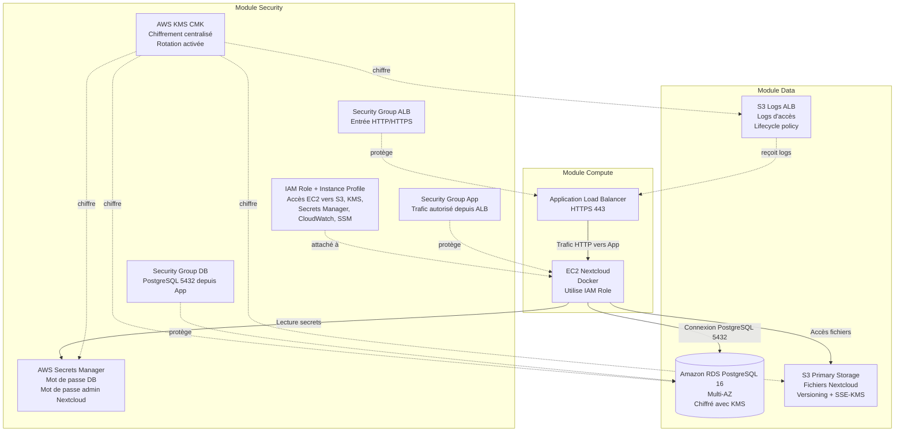

# Architecture — TP05 Nextcloud sur AWS

## Vue d'ensemble

L'infrastructure est déployée sur AWS à l'aide de Terraform selon une architecture modulaire. Chaque composant est isolé dans un module dédié afin de faciliter le développement collaboratif, la maintenance et l'intégration continue.

Les principaux modules sont :

* **Security** : gestion du chiffrement, des permissions IAM, des secrets et des Security Groups.
* **Data** : gestion du stockage des fichiers Nextcloud et de la base de données PostgreSQL.
* **Compute** : exécution de l'application Nextcloud sur une instance EC2 derrière un Application Load Balancer.

---

## Diagramme d'architecture

---

## Description des composants

### Module Security

Le module Security constitue le socle de sécurité de l'infrastructure.

Il fournit :

* Une clé AWS KMS avec rotation automatique pour le chiffrement des données.
* Les secrets applicatifs stockés dans AWS Secrets Manager.
* Les rôles IAM et Instance Profiles nécessaires aux instances EC2.
* Les Security Groups protégeant l'ALB, les instances applicatives et la base de données.

### Module Data

Le module Data assure la gestion du stockage et de la persistance des données.

Il comprend :

* Une base de données Amazon RDS PostgreSQL 16 en mode Multi-AZ.
* Un bucket S3 principal pour les fichiers Nextcloud.
* Un bucket S3 dédié aux logs de l'Application Load Balancer.
* Le chiffrement SSE-KMS et les politiques de cycle de vie des données.

### Module Compute

Le module Compute héberge l'application Nextcloud.

Il comprend :

* Un Application Load Balancer accessible en HTTPS.
* Une instance EC2 exécutant Nextcloud dans Docker.
* L'utilisation du rôle IAM fourni par le module Security.
* L'accès sécurisé aux ressources S3, Secrets Manager et RDS.

---

## Flux principaux

1. L'utilisateur accède à Nextcloud via l'Application Load Balancer en HTTPS.
2. L'ALB redirige les requêtes vers l'instance EC2 hébergeant Nextcloud.
3. L'instance récupère ses secrets depuis AWS Secrets Manager.
4. Les fichiers utilisateurs sont stockés dans le bucket S3 principal.
5. Les métadonnées sont enregistrées dans PostgreSQL sur Amazon RDS.
6. Les logs de l'ALB sont envoyés dans le bucket S3 dédié.
7. Toutes les données sensibles sont chiffrées grâce à AWS KMS.

---

## Sécurité

Les mesures de sécurité mises en œuvre sont :

* Chiffrement KMS des données au repos.
* Gestion centralisée des secrets avec AWS Secrets Manager.
* Séparation des flux réseau via Security Groups.
* Principe du moindre privilège avec IAM.
* Blocage de l'accès public sur les buckets S3.
* Base de données accessible uniquement depuis l'application.
